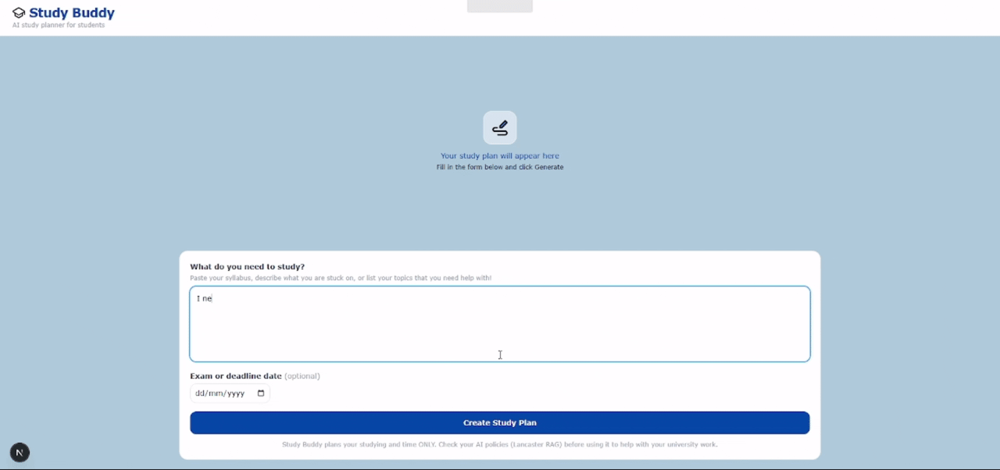

# Study Buddy

Study Buddy helps students revise by managing and structuring their time when 
preparing for assignments, quizzes and exams with the help of AI, with a 
particular focus on supporting neurodiverse students.

## The Problem

When there is a large amount of content to revise, many students feel left 
wondering where to start. This is particularly common in neurodiverse students.

## Solution

Study Buddy lets users describe what they need to study, which is sent to the 
Gemini API. A structured study plan is generated, topic difficulty is estimated 
and content is broken into manageable chunks for revision. This gives students 
a clear starting point rather than feeling overwhelmed, which is particularly 
useful when juggling multiple deadlines.

- Topic cards showing the main areas to revise
- Difficulty bars colour coded 1-10
- Metrics showing total study time and a workload score
- A pomodoro timer to help maintain concentration and focus

## How it uses AI

Student input is sent to Google's Gemini AI, which returns a structured study 
plan. The app then visualises this as topic cards, difficulty bars and a 
pomodoro session schedule.

The interface supports neurodivergent students including those with ADHD and 
dyslexia through clear visual structure and the Atkinson Hyperlegible font.

## Built with

- Next.js 14 (App Router)
- TypeScript
- Tailwind CSS
- Google Gemini API

## How to use Study Buddy

1. Clone the repository
```bash
git clone https://github.com/khans38/ai-study-buddy.git
cd ai-study-buddy
```
2. Install dependencies
```bash
npm install
```
3. Set up your environment variables
```bash
cp .env.example .env
```
Add your Gemini API key to `.env` — get a free key at https://aistudio.google.com
```
GEMINI_API_KEY=your_api_key_here
```
4. Run the development server
```bash
npm run dev
```
5. Open http://localhost:3000

## Example Demo

**Input:**
> I need to revise for my maths exam which is on Friday, linear algebra and 
> binomial distribution. I have a stats exam next week on Tuesday which is on 
> normal distribution and hypothesis testing too.



**Output:**
> A structured study plan with topic cards, difficulty bars, workload metrics 
> and a pomodoro session schedule generated from your input.
